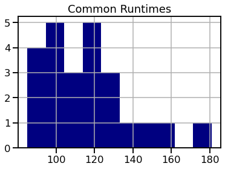

# Module 1 Final Project

## Introduction

I decided to use the data given, as well as take advantage of the python library, "Beautiful Soup", to webscrape important pieces of information from imdb.com that would serve to be beneficial to Microsoft. From information on budgets, runtimes, ratings, I was able to put together an array of information on who Microsoft should get in touch with, and what they generally should or shouldn't do when making their break into the movie industry. In the first section of this document, the code provided by Flatiron will be analyzed, while the data in the second part will be coming from imdb.com directly.

## Objectives

Main questions to investigate:

* How long should the first movie be?
* How much money should be put into the movie?
* What should the movie be rated?
* What kind of movies had the highest ratings from viewers?
* What directors/movies should be studied?

# Data Analaysis (Flatiron Data)

## Budget

When entering the film industry, Microsoft should not be afraid to spend fair amounts of money during the production process. As the below graph shows, films that invest more in their movies are more likely to get generate higher amounts of revenue. This can also be attributed to the fact that movies with higher budgets usually will allocate some of this money towards advertising, and in turn more people will end coming to the movies to see it.

 

However, not all movies that have high budgets are prone to make lots of money. Some movies in the past have done very good jobs of making the most out of the limited amount of money set aside for production.

If we take a look at the four movies above, we can see that they each ended up making 400 times or more of the money they put in. Microsoft should watch and thouroughly study each of the these movies. Do the movies look as if they were low budget? What do they all have in common? Adding on, Microsoft should contact each of the above directors and production teams to recieve some pointers.

# Run Time

Most of the data surrounding run times for the top 100 rated movies shows that these movies generally fall between 110 and 130 minutes. Adding on, there is a slight positive correlation between runtime and average rating. There are a few outliers, which could be because those who watched a long movie but did not enjoy it are prone to give a worse rating than if the movie was normal length.

 

# Genre

In terms of genre, it was apparent that out of the top 100 rated movies, three genres were the most popular. These genres were drama, adventure, and comedy. 

 

# Data Analaysis (imdb.com)

Many of the same types of data analysis were done through the information recieved from imdb.com. Many of the information obtained through beautifulsoup was very recent, and included many popular movies from 2020, like Parasite and Tenent. If Microsoft is going to enter the film industry, they should have the most up to date information available, and that is exactly what will be provided through the images below. All the data analyzed through imdb.com comes from a movie between the years 2015 and 2020.

## Ratings

A movies given ratings (R, PG-13, etc.) is a very important factor of each movie, and it was missing from the data provided. With this data given to us, it was easy to see the ratings that generally had the best ROI, average rating, and so on. 

 

Out of the most popular movies obtained from 2015 to 2020, it was obvious that people seemed to enjoy movies rated R or PG-13 better than moves rated PG. Some reasons for this could be that PG movies are usually targeted towards a younger and smaller audience, or that R and PG-13 movies are able to contain more polarizing content that will either make an audience love or hate the movie (move toward both extremes).

In terms of return on investment, movies that were rated "R" tended to have a higher mean ROI (Revenue/Budget) compared to movies rated PG and PG-13.

 

## Runtime

imdb.com also included information on runtime for each of the popular movies selected from 2015-2020. More data analysis was done through the runtime data to see if it conveyed the same message or went against the conclusions made on runtime earlier. 

   

As seen above, the most popular run times for the most popular movies off of imdb mirror the results obtained earlier. The most common runtimes also seem to be between 110 and 130 minutes. This result can also be examined through the histogram titled "Common Runtimes". Lastly, runtime was compared to return on investment for each movie. While there seems to be a slight correlation, I would not suggest that a longer movie results in an increased ROI. 

## Conclusion

After analysis of the given data, as well as data analyzed through BeautifulSoup, there are a few assumptions that can be made. First of all, Microsoft should er on the side of producing a movie rated PG-13, or R, as these ratings accounted for a large majority of the most popular movies examined. The runtime of the movie should be around 120 minutes, but there shouldn't be that much worry if it goes over. Microsoft would be best off producing an action, adventure, or drama movie as these were the most popular genres of the top 100 rated movies (Flatiron Data). There also shouldn't be too much worry on spending a large chunk of money during the production process, as the data suggested that the more movies invest in themselves the more revenue they usually tend to recieve. Lastly, movies such as Mad Max, Paranormal Activity 4, The Gallows, and The Blair Witch Project should all be watched and studied to see how they all made over 400 times the money they invested in the production process. 

